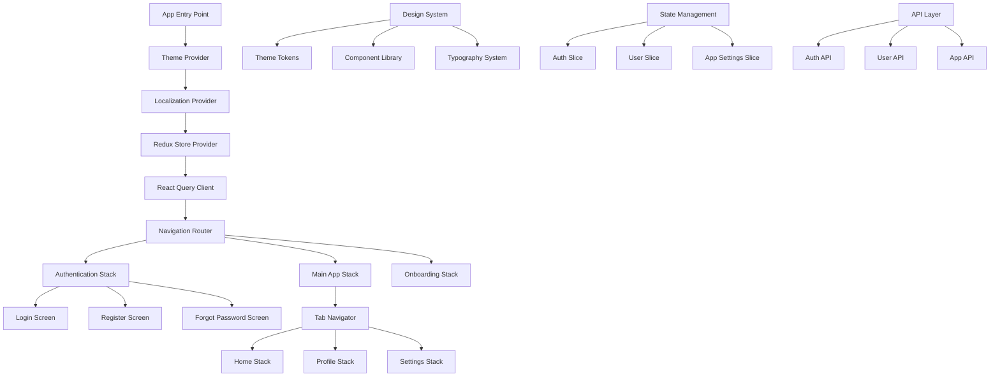

# Design Document

## Overview

The Universal Expo React Native Template is architected as a modular, scalable foundation that provides developers with a production-ready starting point for mobile applications. The design emphasizes developer experience, customization flexibility, and modern React Native patterns while maintaining clean separation of concerns.

## Architecture

### High-Level Architecture



### Folder Structure

```
src/
├── components/           # Reusable UI components
│   ├── ui/              # Base design system components
│   ├── forms/           # Form-specific components
│   └── common/          # Shared app components
├── screens/             # Screen components organized by feature
│   ├── auth/            # Authentication screens
│   ├── onboarding/      # Onboarding flow screens
│   ├── home/            # Home feature screens
│   ├── profile/         # Profile feature screens
│   └── settings/        # Settings feature screens
├── navigation/          # Navigation configuration
│   ├── types.ts         # Navigation type definitions
│   └── guards.ts        # Navigation guards
├── store/               # Redux store configuration
│   ├── slices/          # Redux slices
│   ├── api/             # RTK Query API definitions
│   └── index.ts         # Store setup
├── services/            # External service integrations
│   ├── api/             # API client configuration
│   ├── storage/         # Async storage utilities
│   └── notifications/   # Push notification setup
├── hooks/               # Custom React hooks
├── utils/               # Utility functions
├── constants/           # App constants and configuration
├── types/               # TypeScript type definitions
├── locales/             # Translation files
└── theme/               # Design system and theming
    ├── tokens.ts        # Design tokens
    ├── components.ts    # Component theme definitions
    └── provider.tsx     # Theme provider implementation
```

## Components and Interfaces

### Theme System

**Theme Provider Interface:**

```typescript
interface ThemeContextType {
  theme: 'light' | 'dark' | 'system';
  colors: ColorTokens;
  typography: TypographyTokens;
  spacing: SpacingTokens;
  setTheme: (theme: 'light' | 'dark' | 'system') => void;
  isDark: boolean;
}

interface ColorTokens {
  primary: ColorScale;
  secondary: ColorScale;
  success: ColorScale;
  warning: ColorScale;
  error: ColorScale;
  neutral: ColorScale;
  background: string;
  surface: string;
  text: TextColors;
}
```

**Design System Components:**

- Button (variants: primary, secondary, outline, ghost)
- Input (variants: default, search, password)
- Card (variants: elevated, outlined, filled)
- Typography (heading, body, caption, label)
- Loading (spinner, skeleton, progress)
- Modal (bottom sheet, center, full screen)

### Navigation System

**Route Type Definitions:**

```typescript
type RootStackParamList = {
  '(auth)': undefined;
  '(onboarding)': undefined;
  '(tabs)': undefined;
};

type AuthStackParamList = {
  login: undefined;
  register: undefined;
  'forgot-password': undefined;
};

type TabsParamList = {
  home: undefined;
  profile: undefined;
  settings: undefined;
};
```

**Navigation Guards:**

- Authentication guard for protected routes
- Onboarding completion guard
- Feature flag guards for conditional navigation

### State Management

**Redux Store Structure:**

```typescript
interface RootState {
  auth: AuthState;
  user: UserState;
  appSettings: AppSettingsState;
  api: ApiState; // RTK Query state
}

interface AuthState {
  isAuthenticated: boolean;
  token: string | null;
  user: User | null;
  loading: boolean;
  error: string | null;
}
```

**React Query Integration:**

- API endpoint definitions using RTK Query
- Automatic caching and background refetching
- Optimistic updates for better UX
- Error handling with retry mechanisms

### Localization System

**i18n Configuration:**

```typescript
interface LocalizationContextType {
  language: string;
  setLanguage: (lang: string) => void;
  t: (key: string, options?: any) => string;
  isRTL: boolean;
}
```

**Translation Structure:**

```
locales/
├── en/
│   ├── common.json      # Common translations
│   ├── auth.json        # Authentication screens
│   ├── onboarding.json  # Onboarding flow
│   └── settings.json    # Settings screens
└── es/
    ├── common.json
    ├── auth.json
    ├── onboarding.json
    └── settings.json
```

## Data Models

### User Model

```typescript
interface User {
  id: string;
  email: string;
  firstName: string;
  lastName: string;
  avatar?: string;
  preferences: UserPreferences;
  createdAt: string;
  updatedAt: string;
}

interface UserPreferences {
  theme: 'light' | 'dark' | 'system';
  language: string;
  notifications: NotificationSettings;
}
```

### App Configuration Model

```typescript
interface AppConfig {
  version: string;
  buildNumber: string;
  environment: 'development' | 'staging' | 'production';
  apiBaseUrl: string;
  features: FeatureFlags;
}

interface FeatureFlags {
  [key: string]: boolean;
}
```

## Error Handling

### Error Boundary Implementation

- Global error boundary for unhandled React errors
- Network error handling with user-friendly messages
- Form validation error display
- API error normalization and display

### Error Types

```typescript
interface AppError {
  code: string;
  message: string;
  details?: any;
  timestamp: string;
}

interface ValidationError extends AppError {
  field: string;
  value: any;
}
```

### Logging Strategy

- Development: Console logging with detailed information
- Production: Structured logging with error reporting service integration
- User action tracking for analytics
- Performance monitoring integration points

## Testing Strategy

### Unit Testing

- Component testing with React Native Testing Library
- Hook testing with custom test utilities
- Redux slice testing with mock store
- Utility function testing with Jest

### Integration Testing

- Navigation flow testing
- API integration testing with MSW (Mock Service Worker)
- Theme switching integration tests
- Localization integration tests

### E2E Testing (Optional)

- Critical user journey testing with Detox
- Authentication flow testing
- Onboarding completion testing
- Settings configuration testing

### Testing Utilities

```typescript
// Custom render function with providers
function renderWithProviders(
  ui: React.ReactElement,
  options?: {
    preloadedState?: Partial<RootState>;
    theme?: 'light' | 'dark';
    language?: string;
  }
) {
  // Provider wrapper implementation
}
```

## Performance Optimizations

### Code Splitting

- Lazy loading of screen components
- Dynamic import of heavy libraries
- Feature-based bundle splitting

### Memory Management

- Proper cleanup in useEffect hooks
- Image optimization and caching
- List virtualization for large datasets

### Bundle Optimization

- Tree shaking configuration
- Asset optimization (images, fonts)
- Metro bundler configuration for optimal builds

## Security Considerations

### Data Protection

- Secure storage for sensitive data (tokens, user preferences)
- Biometric authentication integration points
- Certificate pinning for API communications

### Input Validation

- Client-side validation with server-side verification
- XSS prevention in user-generated content
- SQL injection prevention in API layer

### Authentication Security

- JWT token management with refresh token rotation
- Secure logout with token invalidation
- Session timeout handling

## Customization Points

### Brand Configuration

```typescript
interface BrandConfig {
  colors: {
    primary: string;
    secondary: string;
    accent: string;
  };
  fonts: {
    heading: string;
    body: string;
    mono: string;
  };
  logo: {
    light: string;
    dark: string;
  };
  appName: string;
}
```

### Feature Toggles

- Environment-based feature flags
- Remote configuration support
- A/B testing integration points

### API Configuration

- Environment-specific API endpoints
- Request/response interceptors
- Custom authentication headers

This design provides a solid foundation that balances flexibility with opinionated best practices, ensuring developers can quickly customize the template for their specific needs while maintaining code quality and performance.
